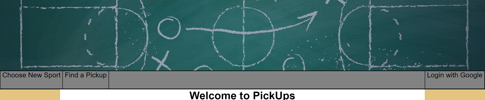
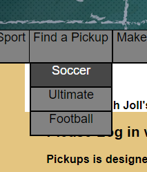
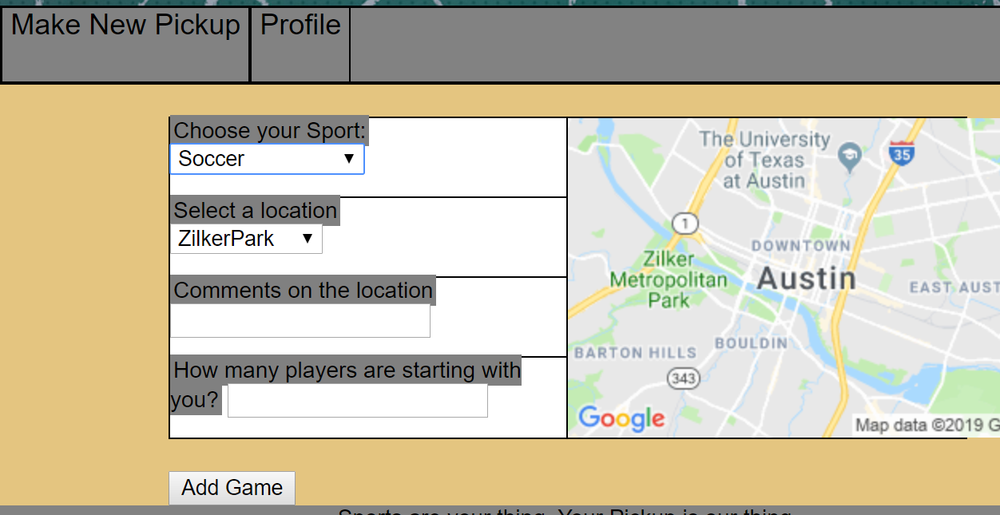

# Pickups

As we age and get away from our childhood practices, it becomes harder and harder to find people to stay fit and have fun with. Pickups was designed to keep us close to the group activities we love and help bring neighbors together!

We built our app to cater to people like:

Samantha, a manager who oversees multiple stores across the city of Austin who wants to play soccer at the end of her day without driving across town to her regular spot.

Steve, who has commitment issues, who finds himself with large blocks of time available to him last minute.

Mary, a general athlete who doesn't have soccer friends but wants to join a new sport.

## Technologies Used

This game uses only the following languages, and should be supported in most browsers:
1. HTML
1. CSS
1. Javascript
1. Node.js
1. Passport
1. Google Oauth2.0

## Development issues

During the development of Pickups, the dev team decided to roll out certain features in future updates to make sure the current user experience is bug free.

1. The implementation of a dynamic google maps was not included due to time constraints. Passable code was written, but we were unable to establish the best way to save and populate locations to and from the database without breaking the population process.  
1. Creating more in depth profile and player databases was the initial goal, however, poor modeling lead to difficulty in accessing much of this data in a clean format.
1. Allowing users to see the names of participants in games so users can play with those they know and have played with before. The current model made data difficult to separate with the way it was stored.

## Find your next game here!

You can find the game here. Right now there are not alot of contributors, but don't let that stop you from posting a game and seeing who shows up!

https://man-child-games.herokuapp.com/

## Future Plans

As we expand we want to more fully integrate Google Maps for better Pickup creation and direction. With this feature you'll be able to see all games happening around you to better find the pickup you want to play in.
